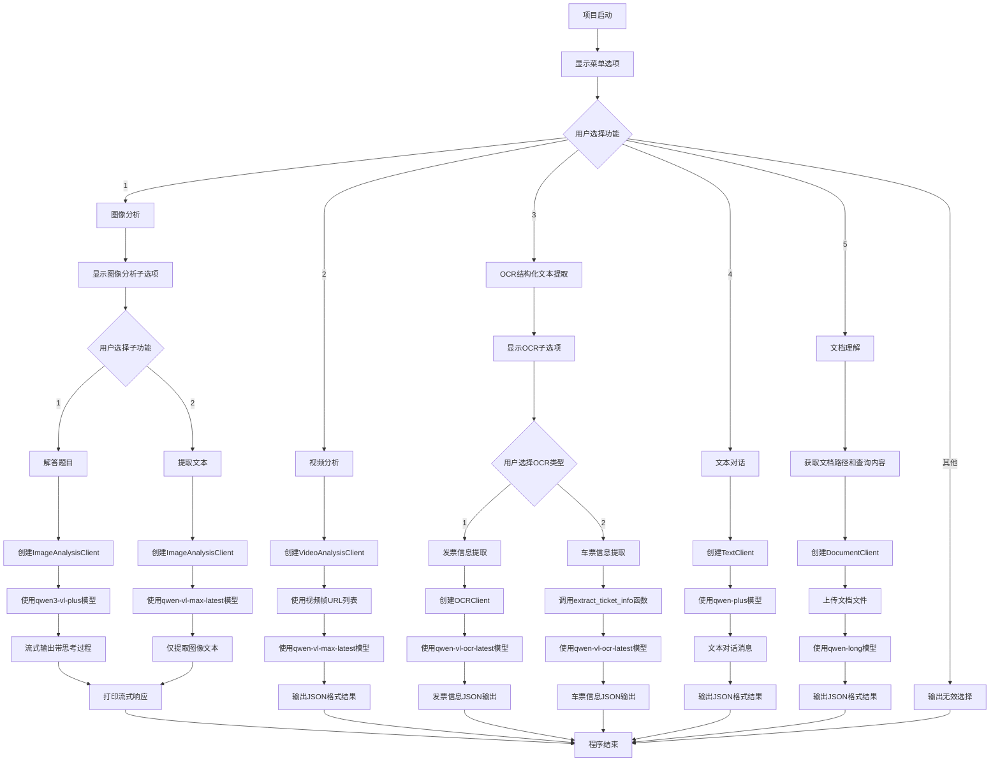

# Qwen-VL-3 项目流程图

```mermaid
graph TD
    A[项目启动] --> B[显示菜单选项]
    B --> C{用户选择功能}
    
    C -->|1| D[图像分析]
    C -->|2| E[视频分析]
    C -->|3| F[OCR结构化文本提取]
    C -->|4| G[文本对话]
    C -->|5| H[文档理解]
    C -->|其他| I[输出无效选择]
    
    D --> D1[显示图像分析子选项]
    D1 --> D2{用户选择子功能}
    D2 -->|1| D3[解答题目]
    D2 -->|2| D4[提取文本]
    
    D3 --> D5[创建ImageAnalysisClient]
    D5 --> D6[使用qwen3-vl-plus模型]
    D6 --> D7[流式输出带思考过程]
    D7 --> D8[打印流式响应]
    
    D4 --> D9[创建ImageAnalysisClient]
    D9 --> D10[使用qwen-vl-max-latest模型]
    D10 --> D11[仅提取图像文本]
    D11 --> D8
    
    E --> E1[创建VideoAnalysisClient]
    E1 --> E2[使用视频帧URL列表]
    E2 --> E3[使用qwen-vl-max-latest模型]
    E3 --> E4[输出JSON格式结果]
    
    F --> F1[显示OCR子选项]
    F1 --> F2{用户选择OCR类型}
    F2 -->|1| F3[发票信息提取]
    F2 -->|2| F4[车票信息提取]
    
    F3 --> F5[创建OCRClient]
    F5 --> F6[使用qwen-vl-ocr-latest模型]
    F6 --> F7[发票信息JSON输出]
    
    F4 --> F8[调用extract_ticket_info函数]
    F8 --> F9[使用qwen-vl-ocr-latest模型]
    F9 --> F10[车票信息JSON输出]
    
    G --> G1[创建TextClient]
    G1 --> G2[使用qwen-plus模型]
    G2 --> G3[文本对话消息]
    G3 --> G4[输出JSON格式结果]
    
    H --> H1[获取文档路径和查询内容]
    H1 --> H2[创建DocumentClient]
    H2 --> H3[上传文档文件]
    H3 --> H4[使用qwen-long模型]
    H4 --> H5[输出JSON格式结果]
    
    D8 --> J[程序结束]
    E4 --> J
    F7 --> J
    F10 --> J
    G4 --> J
    H5 --> J
    I --> J
```